# Credit_Risk_Analysis

## Overview

For this project we will use machine learning to analyze the credit card dataset from LendingClub. We will use multiple techniques and models to have a better overall understanding of the predicting credit risk.

## Results

### Naive Random Oversampling

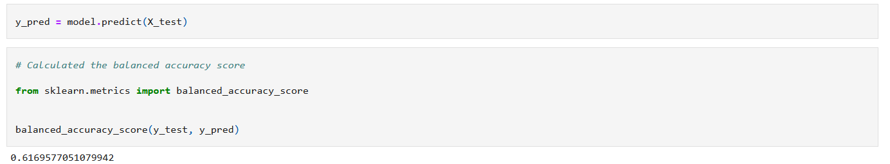

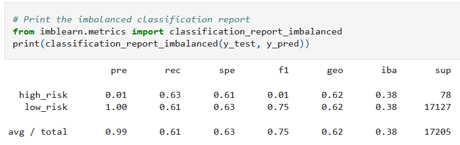

- The balanced accuracy score is 62%. 
- Low risk precision is 100% while high risk is only 1%.

### SMOTE Oversampling

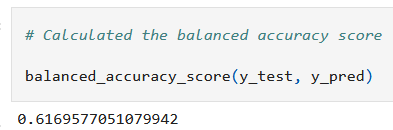

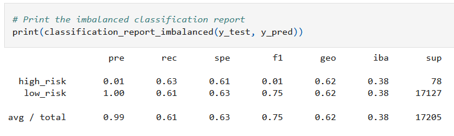

- The balanced accuracy score is 62%. 
- Low risk precision is 100% while high risk is only 1%.

### Undersampling CluseterCentroid

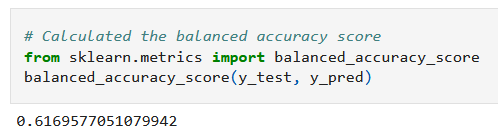

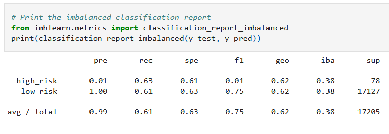

- The balanced accuracy score is 62%. 
- Low risk precision is 100% while high risk is only 1%.

### SMOTEENN Combination Sampling

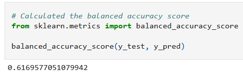

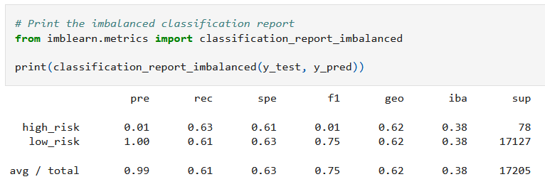

- The balanced accuracy score is 62%. 
- Low risk precision is 100% while high risk is only 1%.

### Balanced Random Forest Classifier

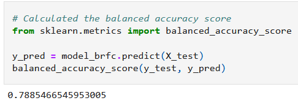

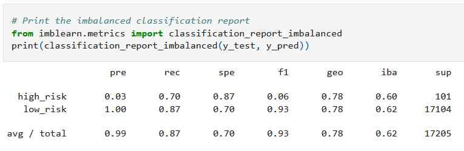

- The balanced accuracy score is 79%. 
- Low risk precision is 100% while high risk is only 3%.

### Easy Ensemble AdaBoost

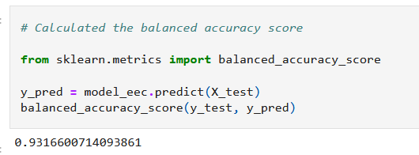

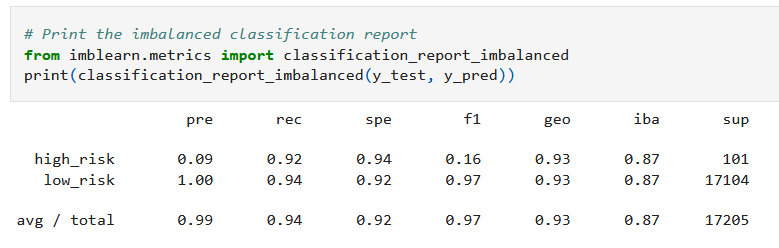

- The balanced accuracy score is 93%. 
- Low risk precision is 100% while high risk is only 9%.

## Summary

After using 6 different techniques we can see that the there are some variation in the results. The first 4 produced similar results with balanced accuracy scores of only ~62%. When switching to a balanced random forest classifier our balanced accuracy goes up to 79%. The final technique used was Easy Ensemble Adaboost with a high score of 93% for the balanced accuracy. Recall is also the highest of all the techniques. High risk precision is still low, but the highest at 9%. 
I would recommend using the Easy Ensemble Adaboost model because of this.
